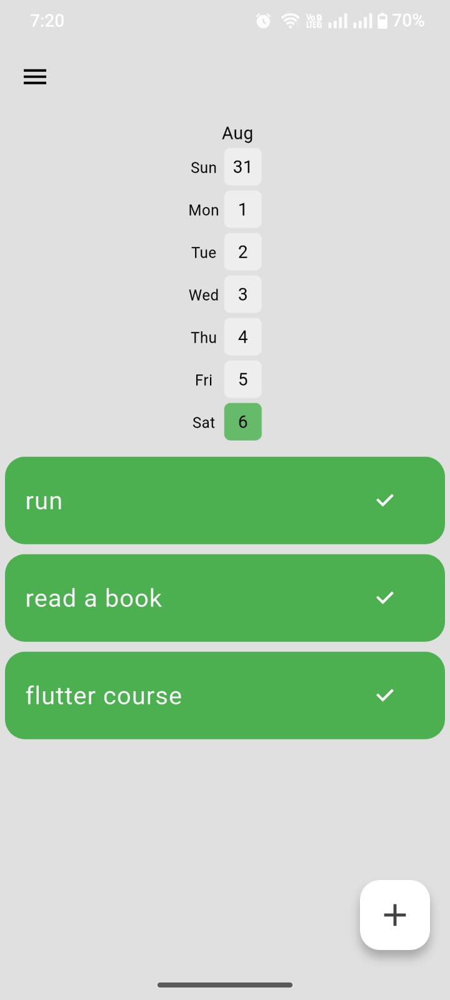
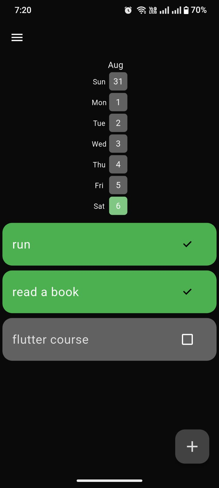
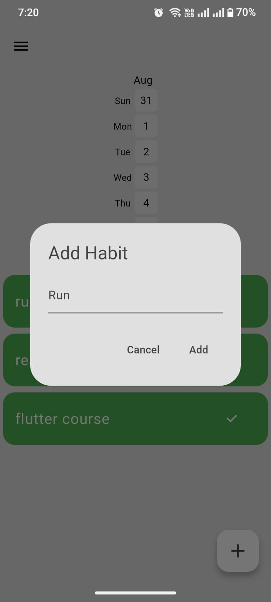

# Minimal Habit Tracker App

A clean, simple, and efficient habit tracking mobile application built with Flutter. Designed to help you build and maintain positive habits without unnecessary complexity.

## ✨ Features

- **Simple Interface**: Clean and intuitive design focused on usability
- **Habit Management**: Add, edit, and remove habits easily
- **Progress Tracking**: Mark habits as complete for each day
- **Visual Feedback**: Clear visual indicators for completed and missed days
- **Streak Counter**: Track your habit streaks to stay motivated
- **Minimal Design**: No clutter, just the essentials for effective habit tracking
- **Local Storage**: Your data stays secure on your device
- **Cross-Platform**: Works on both iOS and Android
- **Offline Support**: Track habits without internet connection
- **Dark/Light Mode**: Comfortable viewing in any lighting condition

## 📱 Screenshots

<!-- Add screenshots here -->
<!-- 
<p align="center">
  
  
  
</p>
-->

## 🚀 Getting Started

### Prerequisites

Make sure you have the following installed on your development machine:

- [Flutter SDK](https://flutter.dev/docs/get-started/install) (version 3.0 or later)
- [Dart SDK](https://dart.dev/get-dart) (comes with Flutter)
- [Android Studio](https://developer.android.com/studio) or [VS Code](https://code.visualstudio.com/)
- [Xcode](https://developer.apple.com/xcode/) (for iOS development on macOS)
- A physical device or emulator for testing

### Installation

1. Clone the repository:
   ```bash
   git clone https://github.com/x00Adham/Minimal-Habit-Tracker-App.git
   ```

2. Navigate to the project directory:
   ```bash
   cd Minimal-Habit-Tracker-App
   ```

3. Get Flutter dependencies:
   ```bash
   flutter pub get
   ```

4. Run the app:
   ```bash
   flutter run
   ```

### Building for Release

#### Android APK
```bash
flutter build apk --release
```

#### Android App Bundle (for Google Play Store)
```bash
flutter build appbundle --release
```

#### iOS (requires macOS and Xcode)
```bash
flutter build ios --release
```

## 🛠️ Usage

### Adding a New Habit

1. Tap the "+" floating action button on the main screen
2. Enter your habit name (e.g., "Drink 8 glasses of water")
3. Optionally add a description for more context
4. Tap "Save" to create the habit

### Tracking Your Habits

1. View your habits on the main dashboard
2. Tap the checkbox to mark a habit as done for today
3. Visual indicators show your progress and current streaks
4. Swipe to delete habits you no longer need

### Managing Habits

- **Edit**: Tap on a habit to modify its details
- **Delete**: Swipe left on a habit to delete it
- **Statistics**: View your completion streaks and progress
- **Daily Reset**: Habits reset automatically each day

## 📁 Project Structure

```
minimal_habit_tracker/
├── android/                 # Android-specific configuration
├── ios/                     # iOS-specific configuration
├── lib/
│   ├── models/
│   │   ├── habit.dart
│   │   └── habit_completion.dart
│   ├── screens/
│   │   ├── home_screen.dart
│   │   └── add_habit_screen.dart
│   ├── widgets/
│   │   ├── habit_tile.dart
│   │   └── habit_list.dart
│   ├── services/
│   │   ├── database_service.dart
│   │   └── habit_service.dart
│   ├── utils/
│   │   ├── constants.dart
│   │   └── themes.dart
│   └── main.dart
├── test/                    # Unit and widget tests
├── pubspec.yaml
└── README.md
```

## 📦 Dependencies

Key Flutter packages used in this project:

```yaml
dependencies:
  flutter:
    sdk: flutter
  sqflite: ^2.3.0           # Local database
  path: ^1.8.3              # File path utilities
  provider: ^6.0.5          # State management
  shared_preferences: ^2.2.2 # Simple local storage
  intl: ^0.18.1             # Date formatting
  cupertino_icons: ^1.0.2   # iOS-style icons

dev_dependencies:
  flutter_test:
    sdk: flutter
  flutter_lints: ^2.0.0     # Linting rules
```


---

*Built with ❤️ using Flutter*
